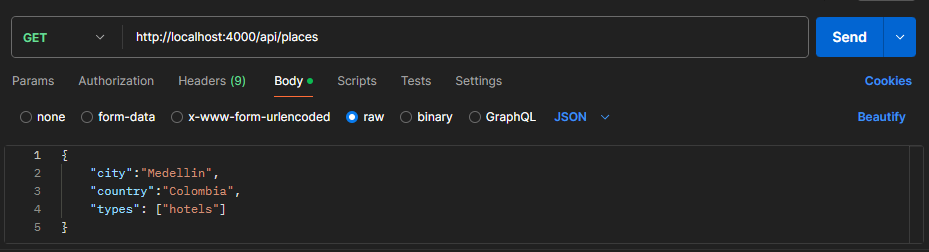

# Proyecto Pasantías wizze

## Descripción

En este proyecto, se desarrolló una API RESTful en Node.js que permite la obtención de información detallada de lugares de interés, como hoteles, restaurantes y atracciones turísticas, basándose en una ciudad específica. La API integra servicios externos como las apis de TripAdvisor y LocationIQ para obtener los datos, y DynamoDB de AWS para almacenar la información.

## Requerimientos

Node.js v20.11.0 en adelante

## Instalación

- Clona el repositorio: `https://github.com/githubjuanmanuel/Proyecto_Pasantias_Wizze.git`
- Accede a la carpeta Proyecto_Pasantias_Wizze: `cd .\Proyecto_Pasantias_Wizze\`
- Instala los modulos de node: `npm i`
- Crea un archivo .env `.env`
- Configura las siguientes variables:

* `PORT =` Puerto inicial que va a utilizar la aplicación. Ejm: 4000
* `API_KEY_TA =` Api key del usuario de tripAdvisor
* `API_KEY_LIQ =` Api key del usuario de locationIQ
* `API_LOCATION_SEARCH_TA =` https://api.content.tripadvisor.com/api/v1/location/search
* `API_NEARBY_SEARCH_TA =` https://api.content.tripadvisor.com/api/v1/location/nearby_search
* `API_REVERSE_GEOCODING_LIQ =` https://us1.locationiq.com/v1/search/structured
* `NOMBRE_DOMINIO =` Nombre del dominio relacionado con la api de tripAdvisor
* `AWS_REGION =` Region donde esta el servidor de aws
* `ACCESS_KEY =` Access key del usuario o cuenta de aws
* `SECRET_KEY =` Secret access key del usuario o cuenta de aws
* `TABLE_NAME =` Nombre de la tambla de dynamoDB en la que se va a cargar la información

## Ejecución del proyecto

- Abrir la terminal y ejecutar alguno de los dos comando:

* Correr el proyecto con nodemon: `npm run dev`
* Correr el proyecto con node: `npm run start`

## Endpoint

GET /api/places
Obtiene lugares y atracciones en base a una ciudad, ademas los sube a la base de datos

## Uso desde postman

Abrir postman y configurar una petición de la siguiente forma


- El método debe ser 'GET'
- La url `http://localhost:PORT/api/places` se debe utilizar el puerto escogido
- city = Nombre de la ciudad en la que se quieren buscar lugares
- country = País donde se encuentra la ciudad
- types = Tipo de lugares (hotels, restaurants, attractions)

Una ves este lista la petición se hace click en el boton Send y se envía. Cuando se haya hecho la petición
en post, si todo funciona correctamente debería aparecer un mensaje diciendo "Todo ok" y en consola se deberían ver
los objetos retornados de la petición a la api.

### Ejemplo de objeto retornado por la api

```
{
    location_id: '7713081',
    name: 'Paragliding Medellin',
    description: "Flying above one of Colombia's greatest towns is what we do! With more than 32 years experience, we will take you on an adventure. Feel, breathe, enjoy! See Medellin from a whole different angle! We pioneered paragliding in colombia ! FLYING SINCE 1992! Ruben is an international certified instructor. We speak English and Spanish. Welcome to the Sky !",
    web_url: 'https://www.tripadvisor.com/Attraction_Review-g297478-d7713081-Reviews-Paragliding_Medellin-Medellin_Antioquia_Department.html?m=66827',
    address_obj: {
      street1: 'Km 6 via san Pedro de los milagros',
      street2: '100 mt before san Felix pay toll RESTAURANTE EL VOLADERO',
      city: 'Medellin',
      country: 'Colombia',
      postalcode: '050001',
      address_string: 'Km 6 via san Pedro de los milagros 100 mt before san Felix pay toll RESTAURANTE EL VOLADERO, Medellin 050001 Colombia'
    },
    ancestors: [ [Object], [Object], [Object] ],
    latitude: '6.33092',
    longitude: '-75.59838',
    timezone: 'America/Bogota',
    email: 'paraglidingmedellin@gmail.com',
    phone: '+57 311 6165601',
    website: 'http://www.paraglidingmedellin.com',
    write_review: 'https://www.tripadvisor.com/UserReview-g297478-d7713081-Paragliding_Medellin-Medellin_Antioquia_Department.html?m=66827',
    ranking_data: {
      geo_location_id: '297478',
      ranking_string: '#5 of 55 Nature &amp; Parks in Medellin',
      geo_location_name: 'Medellin',
      ranking_out_of: '55',
      ranking: '5'
    },
    rating: '4.5',
    rating_image_url: 'https://www.tripadvisor.com/img/cdsi/img2/ratings/traveler/4.5-66827-5.svg',
    num_reviews: '221',
    review_rating_count: { '1': '8', '2': '2', '3': '6', '4': '9', '5': '196' },
    photo_count: '248',
    see_all_photos: 'https://www.tripadvisor.com/Attraction_Review-g297478-d7713081-m66827-Reviews-Paragliding_Medellin-Medellin_Antioquia_Department.html#photos',
    hours: { periods: [Array], weekday_text: [Array] },
    category: { name: 'attraction', localized_name: 'Attraction' },
    subcategory: [ [Object], [Object], [Object], [Object], [Object], [Object] ],
    category: { name: 'attraction', localized_name: 'Attraction' },
    subcategory: [ [Object], [Object], [Object], [Object], [Object], [Object] ],
    subcategory: [ [Object], [Object], [Object], [Object], [Object], [Object] ],
    groups: [ [Object], [Object], [Object], [Object] ],
    neighborhood_info: [],
    trip_types: [ [Object], [Object], [Object], [Object], [Object] ],
    awards: [ [Object] ]
  }
```

## Tecnologías Utilizadas

- Node.js
- Express
- Dotenv
- Axios
- Nodemon
- AWS SDK Client DynamoDB
- AWS SDK Util DynamoDB

## Autores

- Juan Manuel Montoya [GitHub](https://github.com/githubjuanmanuel) [LinkedIn](https://www.linkedin.com/in/juan-manuel-montoya-montoya-03767a26a/)
- Jhon Anderson Marin [GitHub](https://github.com/samoyedo15) [LinkedIn](https://www.linkedin.com/in/jhon-anderson-marin-marin-2752b3125/)

Las pasantías se realizaron en ByLogic
